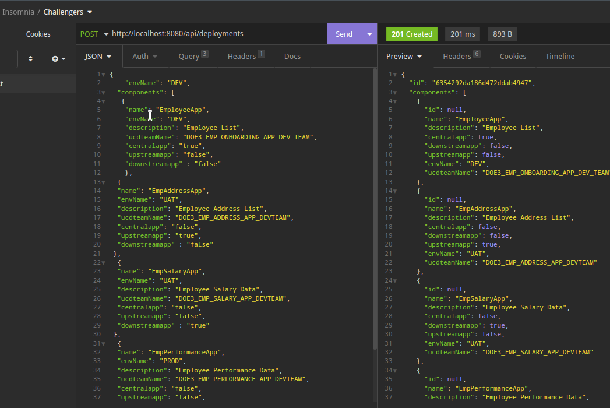
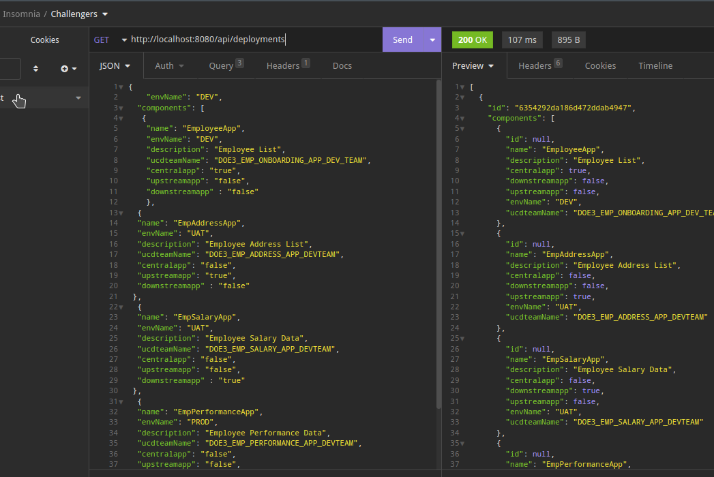
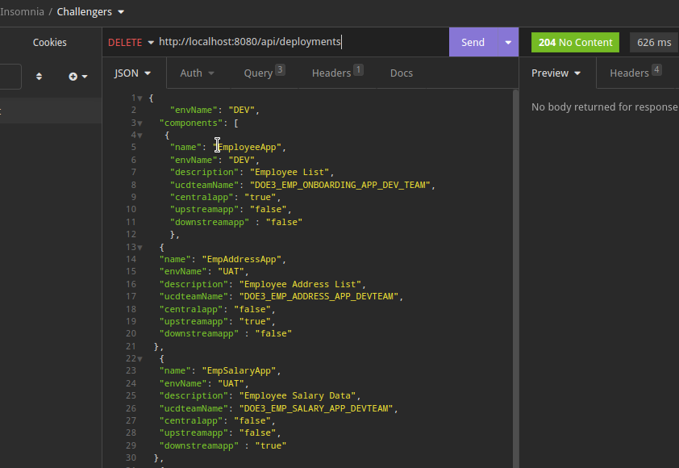
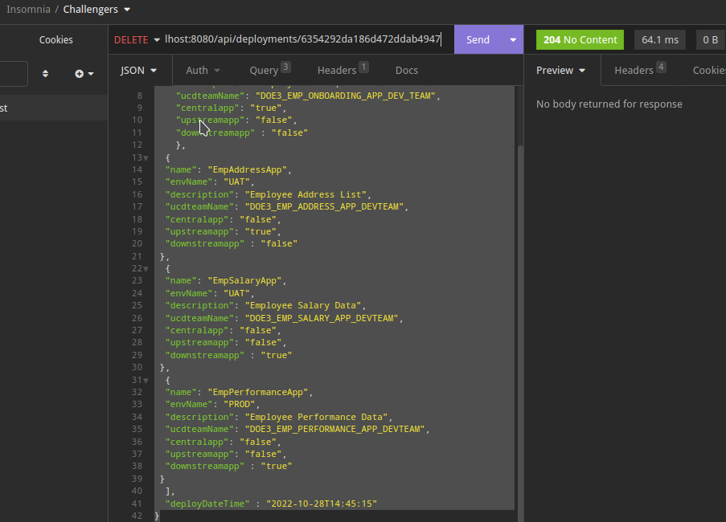
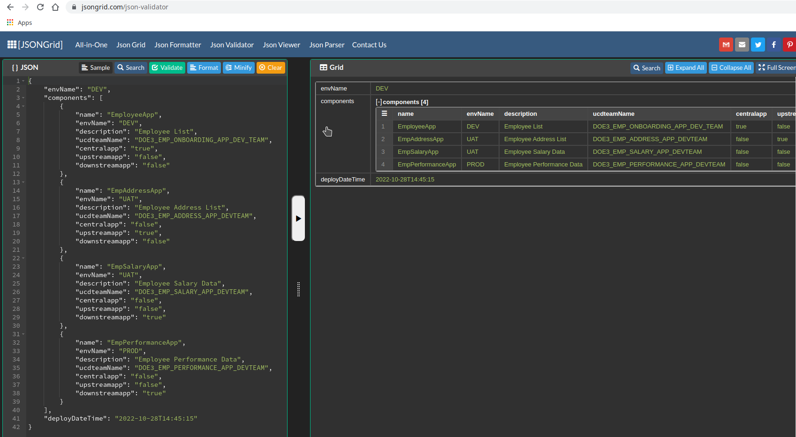

# Challengers App Env Mapping

- Before Deploying this app, please create a free account in MongoDB Atlas and get the credential string `challengers-env-app-map/master/src/main/resources/application.properties` right. The idea behind this solution is to allow applications of one environment such as `DEV` to be connected to applications deployed in a higher environment like `UAT` or `STAGING` or `PROD` which may have a different release version or database version. The `Central' app means the Subject App or Searched App for which we are interested to know the connectivity diagram. This solution generates the json that can be rendered in a Java Script Framework like Angular or VuejS with support from additional Graphical Libraries like d3.js or its likes.

## Run Spring Boot application
```
mvn clean install
```
```
mvn spring-boot:run
```
Once the application is up test this by the following GET,PUT,POST,DEL Methods

- In Insomnia or Postman send a POST request `http://localhost:8080/api/deployments` using the following json body


- Request
```{
	  "envName": "DEV",
	"components": [
 	 {	
  	"name": "EmployeeApp",
  	"envName": "DEV",
	  "description": "Employee List",
    "ucdteamName": "DOE3_EMP_ONBOARDING_APP_DEV_TEAM",
	  "centralapp": "true",
    "upstreamapp": "false",
    "downstreamapp" : "false"
    },
	{
	"name": "EmpAddressApp",
	"envName": "UAT",
	"description": "Employee Address List",
  "ucdteamName": "DOE3_EMP_ADDRESS_APP_DEVTEAM",
	"centralapp": "false",
  "upstreamapp": "true",
  "downstreamapp" : "false"
 },
	{
	"name": "EmpSalaryApp",
	"envName": "UAT",
	"description": "Employee Salary Data",
  "ucdteamName": "DOE3_EMP_SALARY_APP_DEVTEAM",
	"centralapp": "false",
  "upstreamapp": "true",
  "downstreamapp" : "false"
 },
	{
	"name": "EmpPerformanceApp",
	"envName": "PROD",
	"description": "Employee Performance Data",
  "ucdteamName": "DOE3_EMP_PERFORMANCE_APP_DEVTEAM",
	"centralapp": "false",
  "upstreamapp": "true",
  "downstreamapp" : "false"
 }
	],
	"deployDateTime" : "2022-10-28T14:45:15"
}
```
- Response
```
{
	"id": "63543b7306c2d237520b0c85",
	"components": [
		{
			"id": null,
			"name": "EmployeeApp",
			"description": "Employee List",
			"centralapp": true,
			"downstreamapp": false,
			"upstreamapp": false,
			"envName": "DEV",
			"ucdteamName": "DOE3_EMP_ONBOARDING_APP_DEV_TEAM"
		},
		{
			"id": null,
			"name": "EmpAddressApp",
			"description": "Employee Address List",
			"centralapp": false,
			"downstreamapp": false,
			"upstreamapp": true,
			"envName": "UAT",
			"ucdteamName": "DOE3_EMP_ADDRESS_APP_DEVTEAM"
		},
		{
			"id": null,
			"name": "EmpSalaryApp",
			"description": "Employee Salary Data",
			"centralapp": false,
			"downstreamapp": false,
			"upstreamapp": true,
			"envName": "UAT",
			"ucdteamName": "DOE3_EMP_SALARY_APP_DEVTEAM"
		},
		{
			"id": null,
			"name": "EmpPerformanceApp",
			"description": "Employee Performance Data",
			"centralapp": false,
			"downstreamapp": false,
			"upstreamapp": true,
			"envName": "PROD",
			"ucdteamName": "DOE3_EMP_PERFORMANCE_APP_DEVTEAM"
		}
	],
	"envName": "DEV",
	"deployDateTime": "2022-10-28T14:45:15.000+00:00"
}
```
- GET api url: `http://localhost:8080/api/deployments`



- DELETE ALL api url: `http://localhost:8080/api/deployments`


- DELETE ONE RECORD api url: `http://localhost:8080/api/deployments/{id}`



- The Design is as follows.


1. Each Record of Deployment Table
   - Got Env Name/Component Name/Deployment Date time - this is updated by a tool after deployment is successful. We can add the release version name if needed - it is assuming the latest version.
     - Each component team can create a record on the deployment table - one record would be converted to a graph in front end.
2. How the component team would know what are valid records to enter ? This design assumes the component team logged in to UCD and found out the dependent components. But in a real scenario, a component team may be interested in a release version like `master.45`, `develop.36` etc. So, we need automation to create a table `Release` which would be similar to the `Deployment` table but without the component list. The  `Release` Table can have the following values for quick reference.
   - `envname`
     - This is the name of the environment where the App Component is deployed 
   - `componentname`
     - This is the name of the app component	 
   - `buildversion`
     - This is the build version such as `master.45` - depends on cicd.yml or pom.xml 
   - `releasedate`
     - This is the deploy date of `master.45` - when the tool is executed after sucecssful deployment this date is updated.